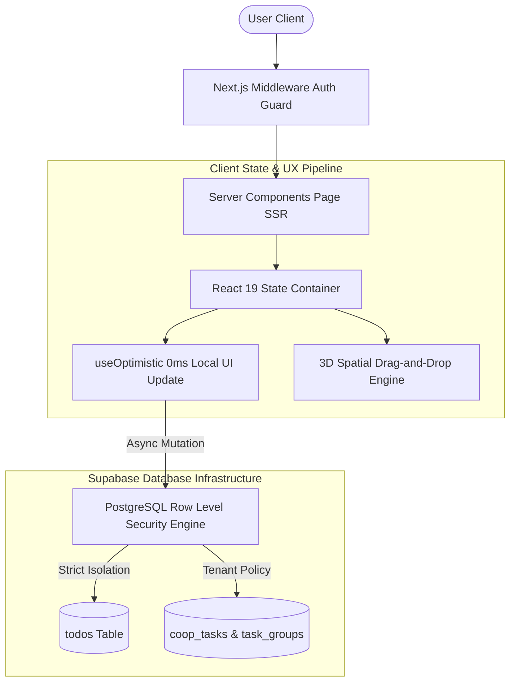

<div align="center">

# ⚡ TaskFlow — Full-Stack Case Study

### High-Performance Personal & Collaborative Task Management Platform Engine

[](https://nextjs.org/)
[](https://react.dev/)
[](https://supabase.com/)
[](https://tailwindcss.com/)
[](https://www.typescriptlang.org/)
[](https://yarnpkg.com/)

[Live Demo](https://taskflow.nexium.studio) • [Architecture Overview](#-architecture--engineering-highlights) • [Database Schema](#-database-schema--rls-security) • [Local Setup](#-getting-started)

---

</div>

## 📌 Executive Summary

**TaskFlow** is an enterprise-grade, full-stack productivity web application designed to solve high-concurrency state synchronization, zero-latency feedback loops, and dynamic collaborative task management. 

Engineered with **Next.js 15 (App Router & React 19)**, **Supabase PostgreSQL (with Server-Side Row Level Security)**, and **Tailwind CSS**, TaskFlow serves as a benchmark case study for modern full-stack Web Architecture, featuring **0ms perceived latency** via React optimistic updates, **3D perspective drag-and-drop feedback**, and **hybrid pagination/infinite-scroll data pipelines**.

---

## 🔬 Architecture & Engineering Highlights



### 1. ⚡ Zero-Latency UX via React 19 Optimistic State Pipeline
Traditional CRUD applications suffer from server round-trip latency (100ms - 500ms) before updating the user interface. TaskFlow utilizes React 19's `useOptimistic` hook paired with `useTransition`:
- **Instant Response**: Task toggles, creation, inline edits, reordering, and deletions render on screen immediately (0ms).
- **Graceful Fallbacks**: If the Supabase mutation fails, state automatically rolls back, and a context-aware error toast alerts the user.

### 2. 🤹 3D Spatial Drag-and-Drop Reordering Engine
- **Perspective Tilt Feedback**: Adjacent cards dynamically compute 3D tilt angles (`rotateX(-2deg)` / `rotateX(2deg)`) and spatial depth (`translateZ(4px)`) when hovering target drop gaps.
- **Position Persistence**: Task positions are indexed as integer positions (`position ASC`) in PostgreSQL, allowing fast array re-index upserts on drop completion without full page re-fetches.

### 3. 🌐 Dual-Engine Workspace (Personal & Team Collaboration)
- **Personal Workspace**: Private task dashboard tied directly to user authentication credentials.
- **Cooperative Group Workspace (`CoopView`)**: Multi-tenant workspace allowing users to create or join shared task groups using cryptographically random **6-character alphanumeric join codes** (e.g. `AX3K9Z`).

### 4. 🚀 Zero-Payload Metric Calculations & Hybrid Pagination
- **0-Byte Head Count Queries**: Total task counts and completion ratios are fetched using Supabase `.select('*', { count: 'exact', head: true })` HEAD requests, eliminating payload transfer overhead for metrics.
- **Dual Display Engine**: Switch seamlessly between fixed-page controls (10, 30, 50 items/page) and an **IntersectionObserver Sentinel Infinite Scroll** engine (20 items/batch).

### 5. 🛡️ Multi-Tenant Row Level Security (RLS)
- Data privacy is enforced natively inside PostgreSQL via Supabase RLS.
- Group membership check helper functions (`is_group_member(group_id, user_id)`) guarantee that users can only read or write tasks within groups they belong to.

---

## ✨ Features

- 🎨 **Modern Dark-Mode UI / UX System**
  - High-contrast glassmorphism visual hierarchy with glowing radial accents.
  - Priority badges (`Low`, `Medium`, `Urgent`) with dynamic left-border visual indicators.
  - Categorization (`Work`, `Personal`, `Studies`, `Focus`) with formatted due-date tracking.
  - Responsive layout optimized across mobile, tablet, and desktop viewports.

- 🔑 **Authentication & Security**
  - Next.js SSR middleware session checks (`/middleware.ts`).
  - Email/Password authentication & password recovery flow with ratelimit cooldowns.
  - OAuth Social Authentication support for **Google** and **GitHub**.

- 🔔 **Contextual Toast Notification System**
  - Centralized React Context (`ToastProvider`) delivering non-blocking success & error alerts.

---

## 🛠️ Tech Stack & Dependencies

| Category | Technology | Description |
| :--- | :--- | :--- |
| **Framework** | Next.js 15.5 (App Router) | React Framework with Server Components & Edge Runtime |
| **UI Library** | React 19 | Leveraging `useOptimistic`, `useTransition`, `useCallback`, `useRef` |
| **Backend & Database** | Supabase PostgreSQL | Authentication, Database Engine, Serverless Functions & RLS |
| **Styling Engine** | Tailwind CSS | Custom glassmorphism, animations, and dark-mode tokens |
| **Icons** | Lucide React | Modern vector icon set |
| **Package Manager** | Yarn 1.22.22 | Deterministic dependency management |

---

## 🗄️ Database Schema & RLS Security

### `todos` Table (Personal Tasks)
```sql
CREATE TABLE public.todos (
  id UUID DEFAULT gen_random_uuid() PRIMARY KEY,
  user_id UUID REFERENCES auth.users(id) ON DELETE CASCADE NOT NULL,
  title TEXT NOT NULL,
  description TEXT,
  is_complete BOOLEAN DEFAULT false NOT NULL,
  priority TEXT DEFAULT 'medium',
  category TEXT DEFAULT 'Personal',
  due_date DATE,
  position INT DEFAULT 0 NOT NULL,
  created_at TIMESTAMPTZ DEFAULT now() NOT NULL
);

-- Row Level Security Policy
ALTER TABLE public.todos ENABLE ROW LEVEL SECURITY;

CREATE POLICY "Users can manage their own todos" ON public.todos
  FOR ALL USING (auth.uid() = user_id);
```

### Cooperative Workspace Schema (`task_groups`, `group_members`, `coop_tasks`)
```sql
-- Helper function to verify group membership
CREATE OR REPLACE FUNCTION public.is_group_member(_group_id UUID, _user_id UUID)
RETURNS BOOLEAN AS $$
  SELECT EXISTS (
    SELECT 1 FROM public.group_members
    WHERE group_id = _group_id AND user_id = _user_id
  );
$$ LANGUAGE sql SECURITY DEFINER;
```

---

## 🚀 Getting Started

### 1. Prerequisites
- **Node.js**: `v18.x` or higher
- **Yarn**: `v1.22.22`
- **Supabase Account**: A active Supabase project

### 2. Clone & Install
```bash
git clone https://github.com/NicholasdeOliveiraSica/TaskFlow.git
cd TaskFlow
yarn install
```

### 3. Environment Configuration
Create a `.env.local` file in the project root:
```env
NEXT_PUBLIC_SUPABASE_URL=https://your-project.supabase.co
NEXT_PUBLIC_SUPABASE_ANON_KEY=your-anon-key
NEXT_PUBLIC_SITE_URL=http://localhost:3000
```

### 4. Database Initialization
1. Open your Supabase SQL Editor.
2. Run `supabase/schema.sql` to setup personal `todos` and RLS policies.
3. Run `supabase/coop_schema.sql` to setup cooperative groups, group tasks, and membership security policies.

### 5. Launch Development Server
```bash
yarn dev
```
Navigate to [http://localhost:3000](http://localhost:3000) to view TaskFlow in action.

---

## 🚢 Production Build

To test production bundle optimization locally:
```bash
yarn build
yarn start
```

---

## 👨‍💻 Author

Developed by **Nicholas de Oliveira Sica**  
- **GitHub**: [@NicholasdeOliveiraSica](https://github.com/NicholasdeOliveiraSica)  
- **Studio**: [Nexium Studio](https://nexium.studio)

---

<div align="center">
  <sub>TaskFlow &copy; 2026 — Engineering High-Performance Full-Stack Applications.</sub>
</div>
